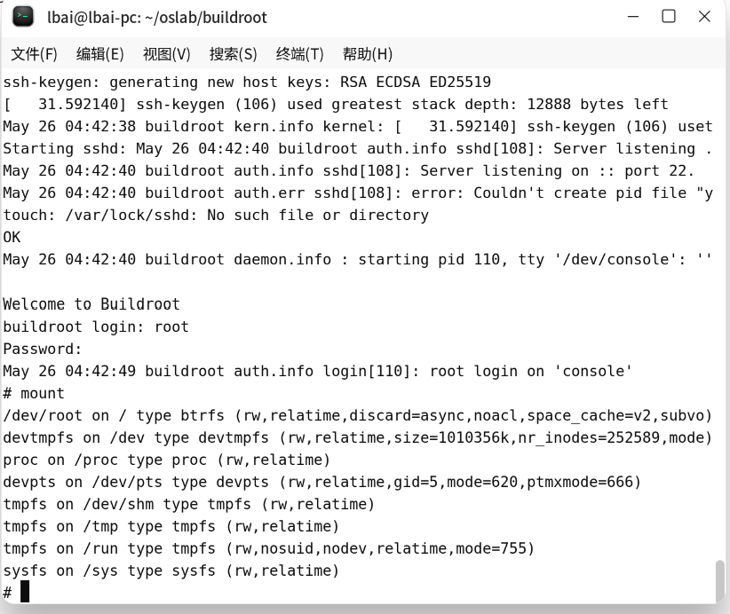
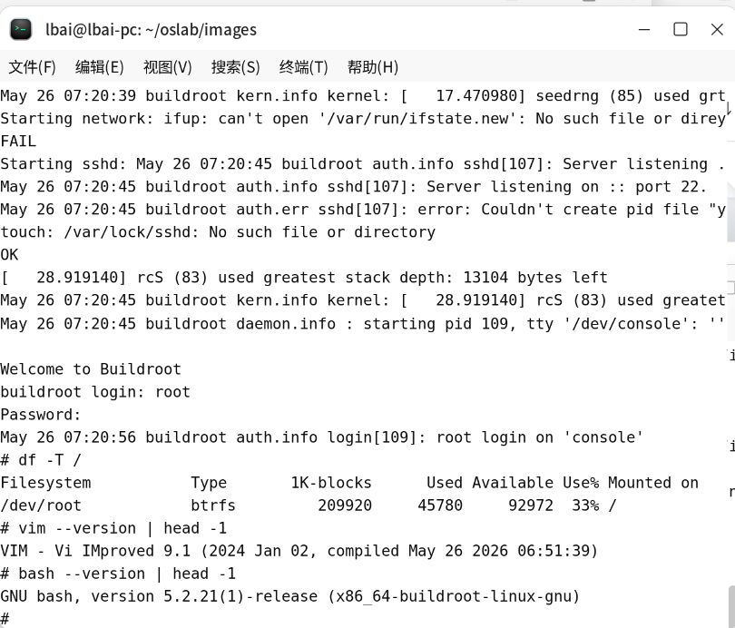
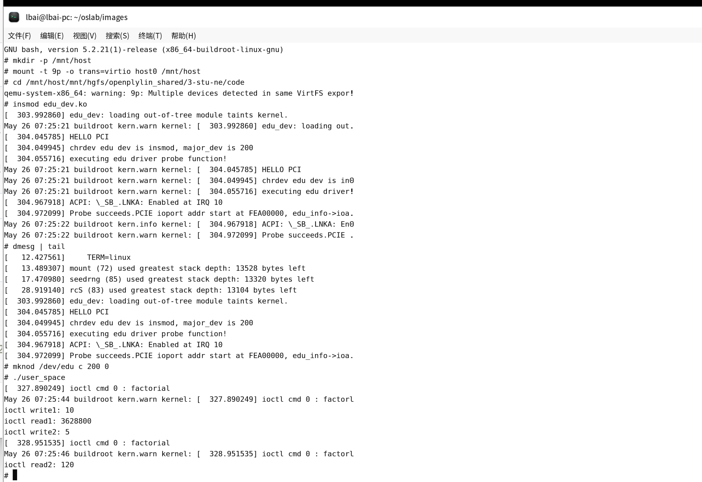
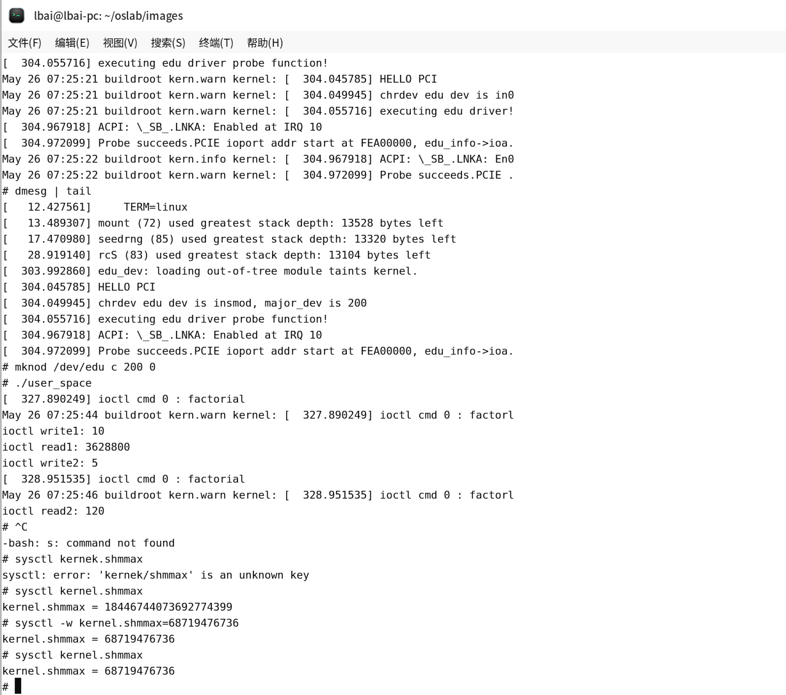

# 4-stu-ne 提交材料

## a. QEMU 启动命令截图

QEMU 启动命令如下：

```sh
cd ~/oslab/images
qemu-system-x86_64 \
  -smp 2 \
  -m 2048 \
  -kernel bzImage \
  -drive file=rootfs.btrfs,if=virtio,format=raw \
  -append "console=ttyS0 root=/dev/vda rw init=/sbin/init" \
  -virtfs local,path=/,mount_tag=host0,security_model=passthrough \
  -device edu \
  -nographic
```

启动进入定制系统后的截图见：



## b. 根文件系统类型、vim、bash 运行截图

截图见：



关键命令及含义：

| 命令 | 含义 |
| --- | --- |
| `df -T /` | 查看 `/` 根目录所在文件系统的磁盘使用情况，`-T` 表示同时显示文件系统类型。截图中 `/dev/root` 的类型为 `btrfs`，说明当前根文件系统是 Btrfs。 |
| <code>vim --version &#124; head -1</code> | 输出 Vim 的版本信息，并通过 `head -1` 只保留第一行，用于验证 Vim 已经被裁剪进系统且可以运行。 |
| <code>bash --version &#124; head -1</code> | 输出 Bash 的版本信息，并只显示第一行，用于验证 Bash 已经被裁剪进系统且可以运行。 |

## c. edu 驱动正常运行截图

截图见：



关键命令及含义：

| 命令 | 含义 |
| --- | --- |
| `mkdir -p /mnt/host` | 创建宿主机共享目录的挂载点，`-p` 表示目录已存在时不报错。 |
| `mount -t 9p -o trans=virtio host0 /mnt/host` | 将 QEMU 通过 `-virtfs` 导出的宿主机目录挂载到客户机的 `/mnt/host`。`-t 9p` 指定 9P 文件系统，`trans=virtio` 指定通过 virtio 传输，`host0` 是 QEMU 启动命令中的 `mount_tag`。 |
| `cd /mnt/host/mnt/hgfs/openplylin_shared/3-stu-ne/code` | 进入宿主机共享目录中的 edu 驱动和用户态测试程序目录。 |
| `insmod edu_dev.ko` | 加载 edu 内核模块。模块初始化后会注册字符设备，并匹配 QEMU 的 EDU PCI 设备，触发驱动的 `probe` 函数。 |
| <code>dmesg &#124; tail</code> | 查看最近的内核日志，用于确认驱动加载和 PCI probe 是否成功。截图中出现 `HELLO PCI`、`major_dev is 200`、`Probe succeeds` 等日志，说明驱动正常工作。 |
| `mknod /dev/edu c 200 0` | 手动创建字符设备节点 `/dev/edu`。`c` 表示字符设备，主设备号 `200` 与驱动中注册的主设备号一致，次设备号为 `0`。 |
| `./user_space` | 运行用户态测试程序。该程序打开 `/dev/edu`，通过 `ioctl` 向驱动发送阶乘计算请求并读取结果。截图中 `10! = 3628800`、`5! = 120`，说明 edu 设备访问和 ioctl 流程正常。 |

## d. 修改后 kernel.shmmax 查询截图

截图见：



关键命令及含义：

| 命令 | 含义 |
| --- | --- |
| `sysctl kernel.shmmax` | 查询内核参数 `kernel.shmmax` 的当前值。该参数表示单个 System V 共享内存段允许的最大字节数。 |
| `sysctl -w kernel.shmmax=68719476736` | 在运行时修改 `kernel.shmmax`，`-w` 表示写入参数值。这里将其设置为 `68719476736` 字节，即 64 GiB。 |
| `sysctl kernel.shmmax` | 再次查询该参数，确认修改后的值已经生效。 |

截图中曾输入 `sysctl kernek.shmmax`，由于 `kernel` 拼写错误，系统提示 unknown key；正确命令应为 `sysctl kernel.shmmax`。
